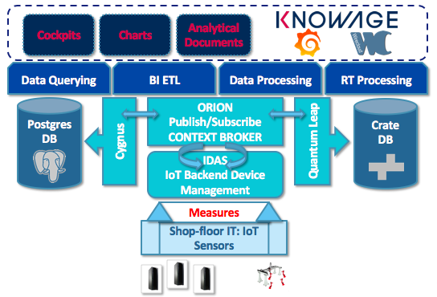

# dida


DIDA is a FIWARE based platform for Smart Industry 

## Tool version

v0.0.1

	- mongo-db: v3.6
	- crate-db: v2.3
	- grafana:  v6.7.3
	- FIWARE Orion: v2.0.0
	- quantum-leap: v0.4

## Deploy
Execute the command into project root folder
```sh
docker-compose up -d
```


## License
The DIDA Platform is licensed under the

GNU Affero General Public License v3.0