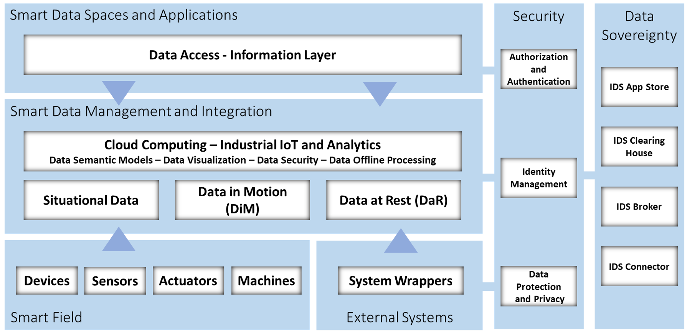

# Digital Industry Data Analytics (DIDA) Platform

## DIDA Architecture in-the-large

## DIDA Architecture in-the-small


DIDA is a FIWARE based platform for Smart Industry 

### Tool version

v0.0.1
	
	- mongo-db: v3.6
	- crate-db: v2.3
	- maria-db: v10.2
	- grafana:  v6.7.3
	- FIWARE Orion: v2.0.0
	- quantum-leap: v0.4
	- knowage v6.2.1

### Deploy
Before starting, set enviroment variable 'service_url' and 'host_url' in file [server.xml](CONF/server.xml) 

Execute the command into project root folder
```sh
docker-compose up -d
```


### License
The DIDA Platform is licensed under the

GNU Affero General Public License v3.0
