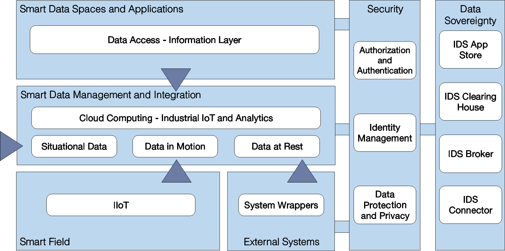

# Digital Industry Data Analytics (DIDA) Platform

## DIDA Architecture in-the-large


### The Reference Architecture layering

The resulting three-tier RA is depicted in Figure *DIDA Architecture in-the-large* and defines several functional macro-components:

*Smart Field* represents the physical layer and contains industrial devices, machines, actuators, sensors, wearable devices, robots, etc. that are spread in the shop floor, and supports the most common industrial and, more in general, IoT protocols such as OPC UA, MQTT, etc. Standards interfaces and protocols must be used, in order to represent the information collected from the plant and to connect and integrate actuators for implementing the sensing and control mechanisms. Data will be collected typically as Data in Motion (DiM) since data coming from IIoT systems are dynamic and should be ingested and processed in real time.

*External Systems* component contains all internal and IT systems for supporting industrial processes (ERPs, PLMs, Supply Chain Mgmt, customized, etc.). It represents static information that comes from Legacy Systems and can be collected as Data at Rest (DaR). Custom interfaces and system wrappers are a crucial part of the component, aiming to share data using smart data models for representing information.

*Smart Data Management and Integration* is the core of the architecture since it contains the brokering, the storage and the data processing capabilities, including cognitive process analytics and simulation systems. Data in Motion (DiM), Data at Rest (DaR) and Situational Data are represented using standard information models and made available using standard APIs. Thought the service layer, data can be collected and persisted supporting a wide range of database (i.e., relational, nosql, time-series). 

*Data Ingestion* sublayer provides a bridge between the physical layer and the data brokering, where the data from the devices are shared in a standardized structure with the broker, putting the information at the disposal of the tools will analyse them. FIWARE IDAS Agent Generic Enabler is the IoT component that translates IoT-specific protocols into the NGSI-LD context information protocol, which is the FIWARE standard data exchange model. IoT Agent for OPC UA, IoT Agent for JSON, IoT Agent for Ultralight are some IDAS Agents in FIWARE Catalogue.

The *Data Brokering* sublayer role is to manage the persistence and processing phase, where the main actors areis the Orion-LD Context Bbroker, able to manage the entire lifecycle of context information including updates, queries, registrations, and subscriptions and Apache Kafka for high-performance data pipelines, streaming analytics, data integration, and mission-critical applications. 

The *Data Persistence and Processing* sublayer is composed of various FIWARE (Cygnus, Quantum Leap. Draco, Cosmos) and Apache (Cygnus, Quantum Leap, Livy, Spark, StreamPpipes) components and is devoted to storing the data collected and process them.  Cygnus, Quantum Leap and Draco are in charge to support the data storage (and pre-processing) acting as a data sink for the persistence vertical. Cosmos is oriented to big data analysis of Streaming and Batch processing over context data, while Spark is a parallel processing framework for running largescale, both batch and real-time, data analytics applications across clustered computers. Data flows can be defined with Draco running Spark jobs through Apache Livy. StreamPpipes is an Industrial IoT toolbox to enable non-technical users to connect, analyze, and explore IoT data streams. Its runtime layer supports the addition of pipeline elements through a built-in SDK in the form of microservices. 

The *Data Visualization* gives a clear understanding of resulting data giving it visual context through maps or graphs. There are specific components, compliant with the most data source that fit different scenarios: Wirecloud enable the quick creation of web applications and dashboards/cockpits, while Grafana supports the analytics and interactive visualization, more oriented to complex monitoring dashboards. Finally, Knowage offers complete set of tools for analytics, paying attention in particular at the data visualization for the most common data sources and big data, covering different topics like Smart Intelligence, Enterprise Reporting, Location Intelligence, Performance Management, Predictive Analysis. Finally, Apache Superset is fast, lightweight, intuitive, and loaded with options that make it easy for users of all skill sets to explore and visualize their data, from simple line charts to highly detailed geospatial charts.

## DIDA Architecture in-the-small


## Modularity and edge-cloud balancing
The described architecture has been conceived with modularity as a main principle: 

Components in every layer can be combined according with a Lego-like approach, fulfilling the exposed data schema, making the architecture flexible and adaptable to the specific needs of the various application domains in process industry.

At the same time the modularity makes possible to approach a microservices design of the application that produces smaller software code, to be organizer as docker containers, so they could be run on smaller processing elements and restricted resources, as we can find in current plants, thus making easier the reuse of existing computing equipments.

In this respect, the DIDA Reference Architecture allows the implementation on both cloud and edge, managing the edge-cloud continuum Figure *DIDA on the Edge* is the edge version of the RA, that can be run on virtualized computing resources nearer to where multiple streams of data are created, thus addressing system latency, privacy, cost and resiliency challenges that a pure cloud computing approach cannot address, and make a big difference in process industry. The edge implementation smoothly integrates with the cloud version, to enable data collection, storing, processing and presentation directly from the plant. Most of the short-term processing, including some data analytics, artificial intelligence and cognitive tasks could be managed at the edge, while cloud resources can be devoted to non-mission critical - massive processing of data.


### Tool version

DIDA is a [FIWARE](https://www.fiware.org/catalogue/) based platform for Smart Industry 

v0.0.3
	
	- FIWARE Orion v2.0.0
	- FIWARE Draco v7.8.1
	- Apache Spark v2.4.5
	- Apache Hadoop 
	- Apache Livy v0.0.7
	- Apache Kafka v2.4.1

### Customization

If your requirements does not need some of the components, they can be removed from provided docker compose file, by simply editing the file and commenting out, or deleting components that are not needed. 

Next to DIDA docker-compose.yml file, you can find Superset docker compose *docker-compose-superset.yml*. This docker file requires environment file, located in same directory and has dependency on DIDA docker compose, in sense that it connects to spark_net and must be run after DIDA docker compose. 

Additional remark for Superset - it will start 6 Superset related containers, each about 2,5Gb so you might run into problem that your machine might run out of resources and that Superset will not work correct.

### Deploy DIDA platform

Execute the command into project root folder

```
docker compose up -d
```

### Superset

After starting DIDA platform, you can start Superset by executing command

```
docker compose -f docker-compose-superset.yml -d
```

After Superset is started, it will require to create user, which is done by following:

```
docker compose exec superset superset-init 
```

Answer the provided questions and create admin user for Superset.

### Superset - creating database

Open browser and navigate to

```
http://localhost:8888/login/

```

Data -> Database -> + Database
Connect a database
Choose from a list of other databases we support
Apache Druid

SQLAlchemy URI - should point to Druid Broker service

```
druid://broker:8082/druid/v2/sql
```

### Create Dataset

Open browser and navigate to Druid console:

```
http://localhost:9888/unified-console.html#
```

Here you can create dataSet needed by Superset to read data from and display data in graphs.

Dataset -> + Dataset

Database - Apache Druid
Schema - druid
See table schema - dataSource we created in Druid

Click on newly created dataset

### License
The DIDA Platform is licensed under the GNU Affero General Public License v3.0

DIDA Platform has received funding from the European Union's Horizon 2020 research and innovation programme under grant agreements No 952003 [AI REGIO](https://www.airegio-project.eu/) and 870062 [CAPRI](https://www.capri-project.com/).
