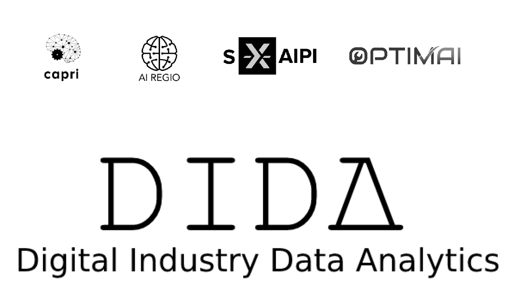

<h1>Digital Industry Data Analytics (DIDA) Platform</h1>

Lorem Ipsum...

## Documentation Contents

-   [Architecture](docs/Architecture.md)
-   [Requirements](docs/Resources.md)
-   [Deployment](docs/Deployment.md)
-   [Run your Algorithms](docs/Usage.md)
-   [Toolkit Versioning](docs/Versioning.md)

## License

The Digital Industry Data Analytics Platform is licensed under [Affero General Public License (GPL) version 3](https://github.com/Engineering-Research-and-Development/dida/blob/master/LICENSE).

© 2021 Engineering Ingegneria Informatica S.p.A.

### Are there any legal issues with AGPL 3.0? Is it safe for me to use?

No problem in using a product licensed under AGPL 3.0. Issues with GPL (or AGPL) licenses are mostly related with the
fact that different people assign different interpretations on the meaning of the term “derivate work” used in these
licenses. Due to this, some people believe that there is a risk in just _using_ software under GPL or AGPL licenses
(even without _modifying_ it).

For the avoidance of doubt, the owners of this software licensed under an AGPL 3.0 license wish to make a clarifying
public statement as follows:

"Please note that software derived as a result of modifying the source code of this software in order to fix a bug or
incorporate enhancements is considered a derivative work of the product. Software that merely uses or aggregates (i.e.
links to) an otherwise unmodified version of existing software is not considered a derivative work, and therefore it
does not need to be released as under the same license, or even released as open source."
